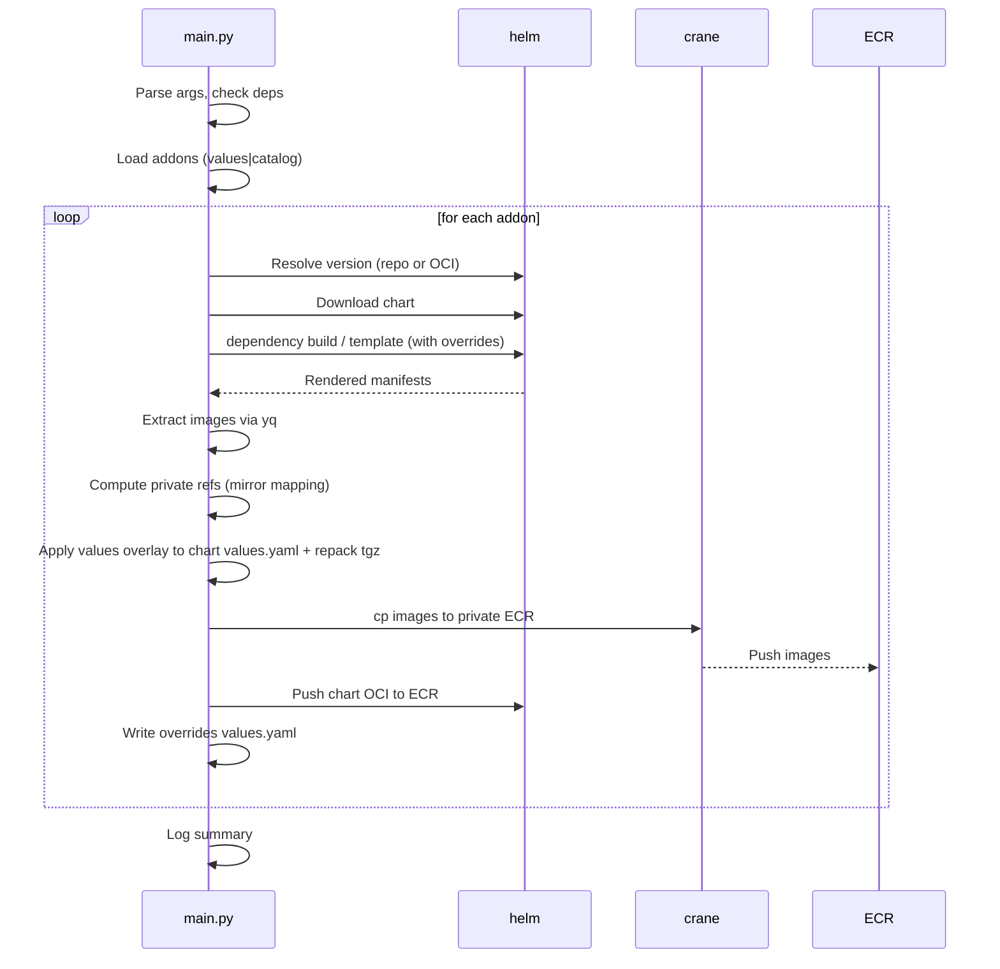

# python-chart-airgab

Purpose
- This tool reads a single repo-level values.yaml that defines multiple addons (Helm charts), then:
  1) Resolves each chart version (supports standard Helm repos and OCI registries like public.ecr.aws and ghcr.io)
  2) Downloads and extracts the chart
  3) Renders the chart to discover container images (via helm template + yq)
  4) Copies those images directly from their source registries into your private ECR (daemonless via crane; no Docker required)
  5) Pushes the Helm chart tarball to your ECR as an OCI artifact (via Helm OCI)
  6) Writes a values.yaml snippet that maps image repositories/tags to your private ECR
  7) Logs a dependency graph for each chart (declared + vendored subcharts)
  8) Tags any ECR repositories created by the script with chart-syncer=true

Typical Use Case
- Move all images and charts referenced by a large “addons” values.yaml into a private, air‑gapped registry so they can be re-used without external downloads.

What gets created
- ECR chart repositories (flattened):
  - oci://<registry>/<chart>:<chart_version> (chart pushed under repo named exactly <chart>)
- ECR image repositories:
  - <registry>[/prefix]/<chart>/<image_name>:<tag>
- Local output:
  - ./helm-charts/<chart>/<chart>-<version>.tgz and extracted chart files
  - ./helm-charts/<chart>/values.yaml (image override snippet for private ECR)

How it Works (high level)
- Discovers addons from ./values.yaml (or a path you supply) OR from a pre-built catalog file (see “Catalog Mode”).
- For each addon:
  - Resolves chart version (--latest or pinned version)
  - Downloads chart and logs dependency graph (Chart.yaml + charts/ tree)
  - Renders chart (optionally with dependencies) and extracts image strings using yq
  - Validates each image exists (crane manifest) and copies to ECR (crane cp)
  - Pushes chart tgz to ECR as OCI (flattened chart repo path)
  - Writes overrides ./helm-charts/<chart>/values.yaml (maps public image -> private repo/tag)

Architecture (Quick Reference)
- High-level pipeline
```mermaid
flowchart TD
  A[Input] -->|values.yaml| V[discover_addons_in_values]
  A -->|catalog.yaml| C[load_catalog]
  V --> L[addons list]
  C --> L

  subgraph "Per Addon"
    L --> R[Resolve version (latest or pinned)]
    R --> D[Download chart (HTTP/OCI)]
    D --> Dep[Log dependency graph / vendor deps?]
    Dep --> T[helm template (+ overrides)]
    T --> E[Extract images (yq)]
    E --> O[Overlay private image refs into chart values.yaml (packaged) + repack]
    O --> CP[Copy images to private ECR (crane cp)]
    CP --> P[Push chart tgz to ECR (helm OCI)]
    P --> W[Write ./helm-charts/<chart>/values.yaml (private refs)]
  end

  W --> S[Summary + status]
```

- Per-chart sequence


Note: The tool modifies the chart’s packaged values.yaml (inside the extracted chart) to point to private image repositories, then repacks the chart tarball. This ensures the chart pushed to ECR has defaults referencing private images. Separately, it writes ./helm-charts/<chart>/values.yaml which maps public→private for consumers to use as an override if desired.

Authentication & Daemonless Operation
- No Docker daemon is used.
- Container images:
  - crane auth login is used to authenticate to registries. Tokens come from AWS CLI for ECR.
  - Private ECR:
    - token = aws ecr get-login-password --region <region>
    - crane auth login -u AWS -p "$token" <account>.dkr.ecr.<region>.amazonaws.com
  - Public ECR:
    - token = aws ecr-public get-login-password --region us-east-1
    - crane auth login -u AWS -p "$token" public.ecr.aws
  - Docker Hub (optional; raises pull rate limits and enables private pulls):
    - crane auth login registry-1.docker.io -u <user> -p <token>
- Helm charts:
  - Helm is used with sandboxed config files and OCI enabled; helm registry login is performed with AWS tokens.

Platform handling (multi-arch vs single-arch)
- Default (--platform auto):
  - crane cp copies the multi-arch manifest index as-is into ECR (recommended). Consumers will pull the right arch automatically.
- Explicit (--platform linux/amd64 or linux/arm64):
  - The tool resolves the child manifest digest for the requested platform from the source image’s manifest index and copies that single-arch manifest (src@sha256:digest -> dst:tag).

Dependencies & Template Robustness
- Dependencies:
  - helm dependency build (sandboxed) to vendor subcharts
  - If build fails, helm template is run with --dependency-update
  - For OCI dependencies on public.ecr.aws, the tool logs into public ECR before dependency operations
- Template required values (External Overrides):
  - Some charts require minimal values to render for image extraction. Provide them in ./chart-overrides.yaml (see “External Overrides” below). If no external entry exists for a chart, the tool falls back to minimal inline overrides for known charts (aws-load-balancer-controller, karpenter) to remain backwards-compatible.

External Overrides (chart-overrides.yaml)
- You can inject per-chart minimal values during helm template without touching code by creating ./chart-overrides.yaml in the repo root.
- Schema:
```
overrides:
  <chart-name>:
    <values-hierarchy>: <value>
```
- Example:
```
overrides:
  karpenter:
    settings:
      clusterName: placeholder
      clusterEndpoint: https://placeholder

  aws-load-balancer-controller:
    clusterName: placeholder
```
- Behavior:
  - If overrides exist for a chart, they are written to .helm-sandbox/<chart>/overrides.values.yaml and passed to helm template via -f.
  - If no external overrides are found for a chart, the tool applies minimal inline --set-string fallbacks for known charts (same values as above).

Catalog Mode (alternate input)
- Instead of scanning values.yaml live, you can run sync using a pre-built catalog file (YAML).
- Catalog schema (top-level list under addons):
```
addons:
  - chart: <str>
    repository: <str>
    oci_namespace: <str>
    version: <str|None>
    release: <str|None>
```
- Generate a catalog with the provided CLI (see next section), then run:
```
python main.py --catalog ./catalog.yaml --push-images --include-dependencies --skip-existing
```
- Notes:
  - --only-addon and --exclude-addons still apply in catalog mode (by release name, case-insensitive, exact match).
  - If an entry has no version, the tool resolves the latest version during sync (same as values mode).

Generator CLI (values_parser.py)
- The catalog generator can be run directly:
```
python values_parser.py --values ./values.yaml --out ./catalog.yaml
python values_parser.py --values ./values.yaml --out ./catalog.yaml --only-addon "aws-load-balancer-controller,karpenter"
python values_parser.py --values ./values.yaml --out ./catalog.yaml --exclude-addons "argo-cd,kube-prometheus-stack"
```
- Arguments:
  - --values (default ./values.yaml): input values defining addons
  - --out (required): output path for catalog
  - --only-addon: comma-separated chart names to include (case-insensitive, exact match)
  - --exclude-addons: comma-separated chart names to exclude (case-insensitive, exact match)
- Exit codes:
  - 0 on success (even if filtered to zero addons)
  - 1 on error

ECR Preflight Controls (skip/verify/overwrite)
- These flags control how existing tags in ECR are handled. They apply to all images (top‑level and dependency images when --include-dependencies is used).
  - --skip-existing (default true):
    - If a destination tag exists in ECR: skip pushing it.
  - --verify-existing-digest (default false):
    - When combined with --skip-existing, only skip if the existing ECR tag digest matches the source digest (index digest for auto, or platform child digest when --platform is set). If digests differ, treat as a mismatch.
  - --overwrite-existing (default false):
    - When a mismatch is detected, delete the existing ECR tag and push the new one.
- Example behaviors:
  - Fast presence skip:
    - --skip-existing
  - Digest-verified skip:
    - --skip-existing --verify-existing-digest
  - Force replacement on mismatch:
    - --skip-existing --verify-existing-digest --overwrite-existing

Filtering addons (values mode)
- Process a subset of addons from values mode:
  - --only-addon "name1,name2": only process listed charts (exact match on chart, case-insensitive)
  - --exclude-addons "name3,name4": exclude listed charts (case-insensitive)
- Order:
  - Apply only-addon first, then exclude-addons.

Requirements
- Python 3.8+
- Helm 3
- yq (Mike Farah) in PATH
- aws CLI v2
- crane (go-containerregistry CLI) in PATH
- AWS credentials with ECR permissions (describe/create/tag/push/list)
- Windows/macOS/Linux supported (no Docker daemon required)

Install
```
pip install -r requirements.txt
```

Quick Start
- Process all addons in values.yaml and copy images/charts to your current AWS account/region ECR:
```
python main.py --values ./values.yaml --latest --push-images --include-dependencies
```

- Push to a specific registry and path prefix for images:
```
python main.py --values ./values.yaml --push-images ^
  --target-registry 123456789012.dkr.ecr.us-east-1.amazonaws.com ^
  --target-prefix team/x
```
(Use \ on Linux/macOS instead of ^)

- Dry run (extract images + write overrides, but do not push):
```
python main.py --values ./values.yaml --scan-only
```

- Control dependency rendering:
```
python main.py --values ./values.yaml --include-dependencies   # default
python main.py --values ./values.yaml --exclude-dependencies
```

- Force single-arch copy (e.g., amd64):
```
python main.py --values ./values.yaml --push-images --platform linux/amd64
```

- Use Docker Hub credentials (raises rate limits & enables private pulls):
```
python main.py --values ./values.yaml --push-images ^
  --dockerhub-username "<YOUR_USER>" --dockerhub-token "<YOUR_TOKEN>"
# or with env:
# set DOCKERHUB_USERNAME=<YOUR_USER>
# set DOCKERHUB_TOKEN=<YOUR_TOKEN>
# python main.py --values ./values.yaml --push-images
```

End-to-end examples
- Values → Catalog → Sync:
```
python values_parser.py --values ./values.yaml --out ./catalog.yaml
python main.py --catalog ./catalog.yaml --push-images --include-dependencies --skip-existing
```
- Direct values with filters:
```
python main.py --values ./values.yaml --push-images --only-addon "aws-load-balancer-controller,karpenter" --exclude-addons "karpenter"
```
- External overrides:
  - Create ./chart-overrides.yaml as shown above; run normal commands. The tool will detect and inject them during helm template.

CLI Arguments (selected)
- --values <path> (default: ./values.yaml)
  Path to an addons values.yaml containing multiple charts. The tool discovers addons by reading known keys (chart, repository/repoUrl, targetRevision) or heuristics.
- --catalog <path>
  Alternate input: pre-built catalog file (see Catalog Mode).
- --latest
  Prefer the latest chart version when resolving. If a chart version is omitted in values.yaml or catalog, latest is applied automatically for that chart.
- --scan-only
  Do not push images/charts. Useful to test render/extraction and generate override values without writing to ECR.
- --push-images
  Copy images (and chart) to the target registry. If neither --scan-only nor --push-images is provided, the tool will push by default.
- --target-registry <REGISTRY>
  Override the destination registry root (default: your AWS account/region ECR discovered via STS and AWS config).
  Example: 123456789012.dkr.ecr.us-east-1.amazonaws.com
- --target-prefix <PREFIX>
  Optional path prefix for image repos under the registry root.
  Example: team/x → <registry>/team/x/<chart>/<image_name>:<tag>
- --include-dependencies / --exclude-dependencies
  Whether to include subcharts when templating to extract images (default: include).
- --platform {auto|linux/amd64|linux/arm64} (default: auto)
  Platform preference for image copies:
  - auto: copy multi-arch manifest list unchanged
  - linux/amd64|linux/arm64: copy a single-arch manifest by selecting the child digest from the index
- --public-ecr-password / env ECR_PUBLIC_PASSWORD
  Override token/password for public.ecr.aws. If not provided, the tool uses current AWS identity via aws ecr-public get-login-password.
- --private-ecr-password / env ECR_PRIVATE_PASSWORD
  Override token/password for your target private ECR. If not provided, the tool uses current AWS identity via aws ecr get-login-password.
- --dockerhub-username / env DOCKERHUB_USERNAME
  Docker Hub username for authenticated pulls (optional; used with crane auth login).
- --dockerhub-token / env DOCKERHUB_TOKEN
  Docker Hub access token (or password) for the username (optional; used with crane auth login).
- --only-addon <NAME[,NAME2,...]> and --exclude-addons <NAME[,NAME2,...]> (values and catalog mode)

Environment Variables (optional)
- ECR_PUBLIC_PASSWORD
  Public ECR token override; otherwise current AWS identity is used.
- ECR_PRIVATE_PASSWORD
  Private ECR token override; otherwise current AWS identity is used.
- DOCKERHUB_USERNAME, DOCKERHUB_TOKEN
  Docker Hub credentials used to authenticate with registry-1.docker.io (crane), improving rate limits and enabling private pulls.

Outputs per chart
- Chart OCI pushed to:
  - oci://<registry>/<chart>:<chart_version> (flattened chart repo path)
- Images pushed to:
  - <registry>/<prefix?>/<chart>/<image_name>:<tag>
- Image overrides values snippet written to:
  - ./helm-charts/<chart>/values.yaml
  - Maps standard image fields (repository/tag pairs) to the new private ECR locations.

Troubleshooting
- crane not found:
  - Install crane (go-containerregistry). On macOS: brew install crane. On Windows: scoop install crane or download a release binary. On Linux: use your package manager or download a release binary.
- ECR auth errors:
  - Ensure aws CLI v2 is installed and that your identity has ECR permissions. The tool uses aws ecr[-public] get-login-password to obtain tokens for crane and helm.
- “name unknown” or 404 on helm push:
  - Chart pushes are flattened to repository named exactly after the chart (no prefix). This matches helm push to oci://<registry>.
- OCI charts on ghcr.io:
  - Some charts are not hosted in GHCR as Helm OCI artifacts. If an OCI lookup fails, use the equivalent HTTP Helm repo (e.g., https://grafana.github.io/helm-charts) for that chart in values or catalog.

Support checklist for new engineers
- Confirm prerequisites installed and on PATH (helm, yq, aws, crane)
- Confirm AWS credentials for the target account/region
- Decide: use default account ECR or set --target-registry and optionally --target-prefix
- Decide dependency handling (--include-dependencies is recommended initially)
- (Optional) Provide Docker Hub credentials to raise pull limits
- Run:
```
python main.py --values ./values.yaml --latest --push-images --include-dependencies --platform auto
```
- Verify in ECR:
  - Chart repository: <registry>/<chart>
  - Image repos: <registry>/<prefix?>/<chart>/<image_name>

Quick Reference: CLI and Examples
- Inputs
  - Values mode: --values ./values.yaml (default)
  - Catalog mode: --catalog ./catalog.yaml
- Filtering
  - Values mode filters by CHART name
  - Catalog mode filters by RELEASE name
  - Examples (catalog mode):
    - Scan-only subset by release:
      - python main.py --catalog ./catalog.yaml --scan-only --only-addon "argocd,karpenter"
    - Exclude a release:
      - python main.py --catalog ./catalog.yaml --push-images --exclude-addons "argocd"
- Registry target and prefix
  - python main.py --values ./values.yaml --push-images --target-registry 123456789012.dkr.ecr.us-east-1.amazonaws.com --target-prefix team/x
- Dependency control
  - Include (default): --include-dependencies
  - Exclude: --exclude-dependencies
- Platform
  - Default multi-arch: --platform auto
  - Single-arch copy: --platform linux/amd64 (or linux/arm64)
- Auth
  - Docker Hub:
    - python main.py --values ./values.yaml --push-images --dockerhub-username "<USER>" --dockerhub-token "<TOKEN>"
