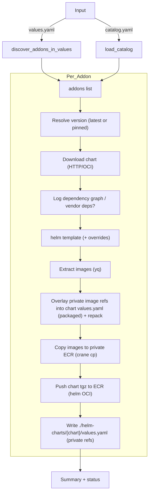
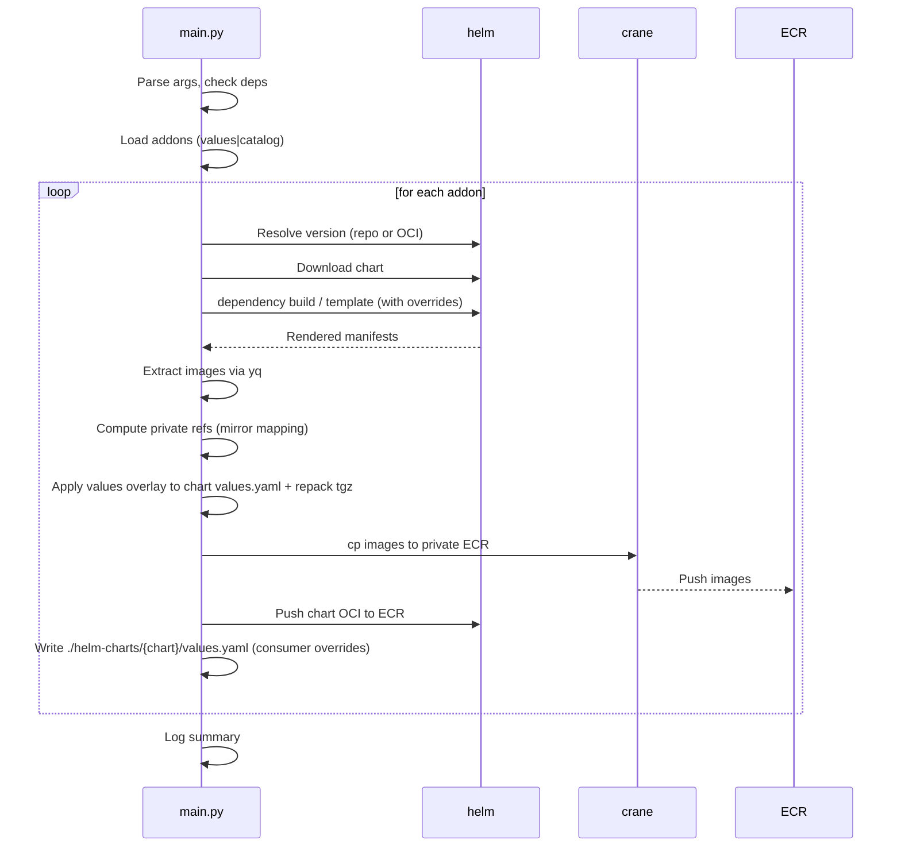

# python-chart-airgab

Helm chart and image mirroring for air‑gapped environments. Discovers addons from a values file or a pre-built catalog, resolves versions, downloads charts, extracts image references, copies images and charts to your private ECR, and writes helpful override values.

Table of Contents
- [Quick Start](#quick-start)
- [Overview](#overview)
- [Architecture](#architecture)
- [Prerequisites](#prerequisites)
- [Installation](#installation)
- [Inputs](#inputs)
- [Usage](#usage)
  - [Input selection](#input-selection)
  - [Behavior](#behavior)
  - [Target registry](#target-registry)
  - [Dependency handling](#dependency-handling)
  - [Platform](#platform)
  - [Auth overrides](#auth-overrides)
  - [ECR preflight](#ecr-preflight)
  - [Filtering](#filtering)
- [Filtering semantics: values vs catalog](#filtering-semantics-values-vs-catalog)
- [Outputs](#outputs)
- [Troubleshooting](#troubleshooting)
- [Support checklist](#support-checklist)

## Quick Start

Sync from values.yaml (prefer latest versions), copy images and push charts; include dependencies:
```
python main.py --values ./values.yaml --latest --push-images --include-dependencies
```

Sync using a pre-built catalog (release-based filtering), push everything:
```
python main.py --catalog ./catalog.yaml --push-images --include-dependencies --skip-existing
```

Copy to a specific ECR registry and team prefix:
```
python main.py --values ./values.yaml --push-images \
  --target-registry {account}.dkr.ecr.{region}.amazonaws.com \
  --target-prefix team/x
```

Dry run (render/extract + write override outputs; do not push):
```
python main.py --values ./values.yaml --scan-only
```

## Overview

This tool:
- Discovers addons (Helm charts) from a values file or a pre-generated catalog
- Resolves chart versions (latest or pinned)
- Downloads charts and logs dependency graphs
- Renders charts and extracts image references
- Copies images (and the chart .tgz) to your private ECR
- Overlays the chart’s packaged values.yaml to reference your private repos, then repacks and pushes the chart
- Writes a consumer-friendly overrides file mapping public → private images

## Architecture

High-level flow


Per-chart sequence


Note
- The tool modifies the chart’s packaged values.yaml (inside the extracted chart) to point to private image repositories, then repacks the chart. The chart you push to ECR has defaults referencing private images.
- Separately, it writes ./helm-charts/{chart}/values.yaml for consumers, mapping public → private references.

## Prerequisites

- Python 3.8+
- Helm 3
- yq (Mike Farah) on PATH
- aws CLI v2
- crane (go-containerregistry) on PATH
- AWS credentials with ECR permissions (describe/create/tag/push/list)
- Windows/macOS/Linux supported (daemonless: Docker not required)

## Installation

Install Python dependencies:
```
pip install -r requirements.txt
```

Authenticate to AWS ECRs when pushing:
- Private ECR:
  - token = `aws ecr get-login-password --region {region}`
  - `crane auth login -u AWS -p "$token" {account}.dkr.ecr.{region}.amazonaws.com`
- Public ECR:
  - token = `aws ecr-public get-login-password --region us-east-1`
  - `crane auth login -u AWS -p "$token" public.ecr.aws`
- Optional Docker Hub (for rate limits/private pulls):
  - `crane auth login registry-1.docker.io -u {user} -p {token}`

## Inputs

Choose one input mode.

- Values mode (default)
  - Provide `--values ./values.yaml`. The tool discovers addons by reading keys like chart, repository/repoUrl, targetRevision (heuristic-friendly).
- Catalog mode (alternate)
  - Provide `--catalog ./catalog.yaml`. Generate catalogs with `values_parser.py`.

Catalog schema example:
```yaml
addons:
  - chart: argo-cd
    repository: https://argoproj.github.io/argo-helm
    oci_namespace: ""
    version: 8.0.10
    release: argocd
```

## Usage

### Input selection
- `--values ./values.yaml` (default)
- `--catalog ./catalog.yaml` (use pre-built catalog)

### Behavior
- `--latest`: prefer latest chart version (also applied when version missing)
- `--scan-only`: render/extract + write outputs; do not push
- `--push-images`: copy images and push chart (default push if neither flag given)

### Target registry
- `--target-registry {account}.dkr.ecr.{region}.amazonaws.com`
- `--target-prefix team/x` (optional nested path for images)

### Dependency handling
- `--include-dependencies` (default): render subcharts when extracting images
- `--exclude-dependencies`: skip rendering subcharts

### Platform
- `--platform auto` (default): copy multi-arch index unchanged
- `--platform linux/amd64` or `--platform linux/arm64`: copy single-arch manifest (child digest)

### Auth overrides
- `--public-ecr-password` / env `ECR_PUBLIC_PASSWORD`
- `--private-ecr-password` / env `ECR_PRIVATE_PASSWORD`
- `--dockerhub-username` / env `DOCKERHUB_USERNAME`
- `--dockerhub-token` / env `DOCKERHUB_TOKEN`

### ECR preflight
- `--skip-existing` (default true): skip tags that already exist
- `--verify-existing-digest`: when skipping, verify digest matches source
- `--overwrite-existing`: on mismatch, delete and overwrite

### Filtering
- Values mode: `--only-addon` and `--exclude-addons` match by CHART name
- Catalog mode: `--only-addon` and `--exclude-addons` match by RELEASE name

Examples
- Values mode (chart-based):
  ```
  python main.py --values ./values.yaml --push-images \
    --only-addon "aws-load-balancer-controller,karpenter" \
    --exclude-addons "karpenter"
  ```
- Catalog mode (release-based):
  ```
  python main.py --catalog ./catalog.yaml --scan-only \
    --only-addon "argocd,karpenter"
  python main.py --catalog ./catalog.yaml --push-images \
    --exclude-addons "argocd"
  ```

Arguments summary (selected)
| Flag | Purpose | Example |
|------|---------|---------|
| --values | Use live values file (default) | --values ./values.yaml |
| --catalog | Use pre-built catalog | --catalog ./catalog.yaml |
| --latest | Prefer latest version (or when version missing) | --latest |
| --scan-only | Do everything except pushing | --scan-only |
| --push-images | Copy images and push chart | --push-images |
| --target-registry | Destination registry root | --target-registry 123456789012.dkr.ecr.us-east-1.amazonaws.com |
| --target-prefix | Optional nested path for images | --target-prefix team/x |
| --include-dependencies | Render subcharts for image discovery | --include-dependencies |
| --exclude-dependencies | Skip subcharts | --exclude-dependencies |
| --platform | Image copy platform strategy | --platform linux/amd64 |
| --only-addon | Filter selection (values=chart, catalog=release) | --only-addon "argocd" |
| --exclude-addons | Exclude selection (values=chart, catalog=release) | --exclude-addons "argocd" |

## Filtering semantics: values vs catalog

- Values mode (from `--values`): filter by chart name.
- Catalog mode (from `--catalog`): filter by release name.

Rationale: catalogs describe intended release names in environments, so filtering by release provides precise control over instances.

## Outputs

Per chart:
- Chart OCI pushed to:
  - `oci://{registry}/{chart}:{chart_version}` (flattened chart repo path)
- Images pushed to:
  - `{registry}/{prefix?}/{chart}/{image_name}:{tag}`
- Local output files:
  - `./helm-charts/{chart}/{chart}-{version}.tgz` and extracted chart files
  - `./helm-charts/{chart}/values.yaml` (consumer overrides mapping public → private)
- Packaged defaults:
  - The chart’s packaged values.yaml is overlaid to private repos and repacked; charts pushed to ECR default to private images.

## Troubleshooting

- crane not found
  - Install crane (go-containerregistry). macOS: `brew install crane`. Windows: `scoop install crane` or download a release. Linux: package manager or release binary.
- ECR auth errors
  - Ensure aws CLI v2 is installed and your identity has ECR permissions. Tool uses `aws ecr[-public] get-login-password` for crane and helm.
- “name unknown” or 404 on helm push
  - Charts are flattened to `{registry}/{chart}`. Ensure you are pushing to the registry root (`oci://{registry}`) with correct auth.
- OCI charts on ghcr.io
  - Some charts are not published to GHCR as Helm OCI artifacts. Prefer HTTP Helm repos when OCI lookup fails.

## Support checklist

- Verify prerequisites on PATH: helm, yq, aws, crane
- Confirm AWS credentials for target account/region
- Decide destination: default account ECR vs `--target-registry` and optionally `--target-prefix`
- Choose dependency handling (start with `--include-dependencies`)
- Optionally set Docker Hub credentials to raise pull limits
- Run a full sync:
  ```
  python main.py --values ./values.yaml --latest --push-images --include-dependencies --platform auto
  ```
- Verify in ECR:
  - Chart repository: `{registry}/{chart}`
  - Image repositories: `{registry}/{prefix?}/{chart}/{image_name}`
