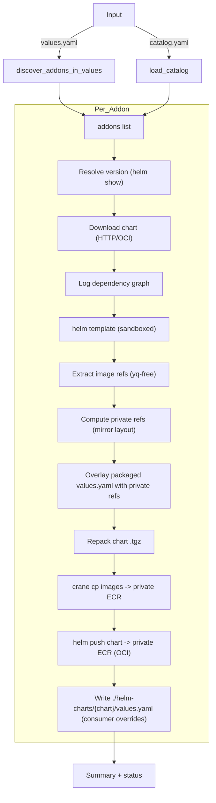
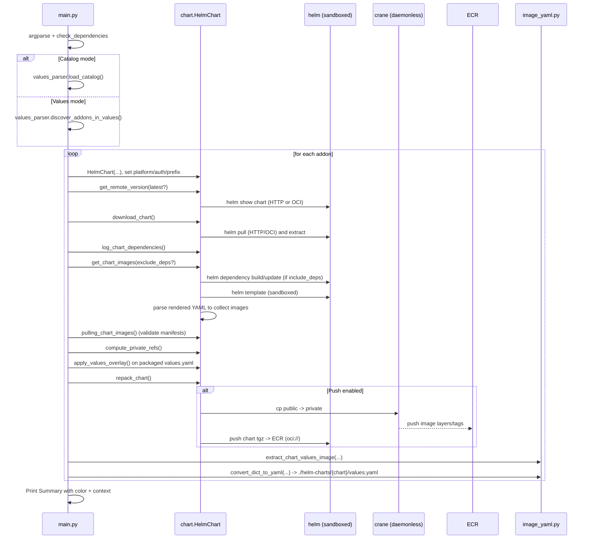

# airgap-charts

Helm chart and image mirroring for air‑gapped environments. Discovers addons from a values file or a pre-built catalog, resolves versions, downloads charts, extracts image references, copies images and charts to your private ECR, and writes consumer override values that map public → private images.

Table of Contents
- Quick Start
- Architecture
- How It Works (code-level)
- Prerequisites and Install
- Inputs and Filtering
- Common Recipes
- CLI Reference (all arguments with examples)
- Behavior Details
  - Dependency handling
  - Platform selection
  - Auth and registries
  - ECR preflight logic (skip/verify/overwrite)
  - External overrides (chart-overrides.yaml)
- Outputs
- Troubleshooting
- Appendix: Generate a catalog from values.yaml

## Quick Start

- Sync from values.yaml, prefer latest versions, include dependencies, mirror images and push chart:
```
python main.py --values ./values.yaml --latest --push-images --include-dependencies
```

- Sync from a pre-built catalog (release-based filtering), push images and chart. Accept multiple catalogs (repeat or comma-separated):
```
python main.py --catalog ./catalog.yaml --catalog ./more.yaml --push-images --include-dependencies
# or
python main.py --catalog "./catalog.yaml,./more.yaml" --push-images
```

- Push to a specific private ECR registry and team prefix path:
```
python main.py --values ./values.yaml --push-images ^
  --target-registry 111122223333.dkr.ecr.us-east-1.amazonaws.com ^
  --target-prefix team/x
```

- Dry run to render and extract, apply private ref overlay into packaged chart, and write consumer overrides without pushing:
```
python main.py --values ./values.yaml --scan-only
```

- Filter a subset of addons:
  - Values mode: by chart name
  - Catalog mode: by release name
```
# Values mode
python main.py --values ./values.yaml --push-images --only-addon "aws-load-balancer-controller,karpenter"

# Catalog mode
python main.py --catalog ./catalog.yaml --scan-only --exclude-addons "argocd"
```

## Architecture

High-level flow


Code-level sequence


Notes
- Helm operations use a sandboxed config under .helm-sandbox/<chart> to avoid OS keyring issues and to keep registry/repository state isolated per addon.
- The packaged chart’s values.yaml is overlaid with private image refs, then repacked before pushing. Consumers pulling the chart from your ECR will see private defaults.
- A separate consumer override file is also written to ./helm-charts/{chart}/values.yaml mapping public → private keys where charts expose image fields.

## How It Works (code-level)

- Entry point: main.py
  - Parses CLI flags and checks external tool dependencies (helm, yq, crane; aws if pushing).
  - Selects input mode:
    - Values mode: values_parser.discover_addons_in_values reads ./values.yaml using heuristics (canonical addons list or recursive probe).
    - Catalog mode: values_parser.load_catalog reads one or more catalog YAMLs, normalized schema.
  - Filters addons via --only-addon/--exclude-addons:
    - Values mode: by chart name
    - Catalog mode: by release name
  - For each addon, constructs chart.HelmChart and sets relevant attributes (public/private ECR password, Docker Hub creds, platform, target registry override, repository prefix, include/exclude dependencies).
  - Delegates to process_helm_chart() which:
    - Resolves version with helm show (HTTP or OCI, login to public ECR when needed).
    - Downloads and extracts chart, logs dependencies, templates the chart (sandboxed helm).
    - Extracts image refs from rendered manifests (no docker daemon; “crane manifest” is used to validate).
    - Computes destination private refs by mirroring source repository path under your private ECR (with optional prefix).
    - Applies overlay into the packaged chart values.yaml and repacks .tgz.
    - Pushes images via crane cp and pushes the chart via helm push (OCI).
    - Writes consumer overrides to ./helm-charts/{chart}/values.yaml.

Key implementation points
- Sandbox helm: custom registry/repository configs at .helm-sandbox/<chart>.
- Dependency handling: helm dependency build/update is invoked when include-dependencies is true.
- Platform selection: optionally resolve a platform-specific child manifest digest to copy a single-arch image.
- ECR preflight (tag-based): check for existing tags and optionally verify digest or overwrite.
- Docker Hub optional auth: used to avoid anonymous rate limits and allow private pulls.

## Prerequisites and Install

- Python 3.8+
- Helm 3
- yq (Mike Farah) on PATH
- aws CLI v2
- crane (go-containerregistry) on PATH
- AWS credentials with ECR permissions (describe/create/tag/push/list)
- OS: Windows/macOS/Linux (daemonless — Docker not required)

Install Python deps:
```
pip install -r requirements.txt
```

Authenticate registries (when pushing):
- Private ECR:
  - token = aws ecr get-login-password --region us-east-1
  - crane auth login -u AWS -p "$token" 111122223333.dkr.ecr.us-east-1.amazonaws.com
- Public ECR:
  - token = aws ecr-public get-login-password --region us-east-1
  - crane auth login -u AWS -p "$token" public.ecr.aws
- Optional Docker Hub:
  - crane auth login registry-1.docker.io -u <user> -p <token>

## Inputs and Filtering

Choose exactly one input mode:
- Values mode (default): --values ./values.yaml
  - Heuristics recognize keys like chart, repository/repoUrl, targetRevision, releaseName, and also “chart paths” (e.g., grafana/tempo) by splitting chart into oci_namespace + chart name.
- Catalog mode (alternate): --catalog ./catalog.yaml
  - The schema is normalized and stable. Generate catalogs using values_parser.py (see Appendix).

Filtering semantics:
- Values mode: --only-addon/--exclude-addons match by CHART name (normalized).
- Catalog mode: --only-addon/--exclude-addons match by RELEASE name.

Rationale: in catalog mode, releases represent intended instances per environment, so release-based selection is more precise.

## Common Recipes

- Full sync to default account ECR (auto-detected account/region), include subcharts:
```
python main.py --values ./values.yaml --latest --push-images --include-dependencies
```

- Mirror to a different account/region and team prefix:
```
python main.py --values ./values.yaml --push-images ^
  --target-registry 444455556666.dkr.ecr.us-west-2.amazonaws.com ^
  --target-prefix platform/team-a
```

- CPU-arch constrained copy (single-arch image for arm64):
```
python main.py --values ./values.yaml --push-images --platform linux/arm64
```

- Dry run to only render, validate refs, overlay packaged chart values, and write consumer overrides:
```
python main.py --catalog ./catalog.yaml --scan-only
```

- Selectively process addons:
```
# Values mode: only 2 charts
python main.py --values ./values.yaml --push-images --only-addon "aws-load-balancer-controller,karpenter"

# Catalog mode: exclude a release
python main.py --catalog ./catalog.yaml --push-images --exclude-addons "argocd"
```

- Increase Docker Hub pull limits (and allow private pulls):
```
python main.py --values ./values.yaml --push-images ^
  --dockerhub-username "$DOCKERHUB_USERNAME" ^
  --dockerhub-token "$DOCKERHUB_TOKEN"
```

## CLI Reference (all arguments with examples)

- --values
  - Description: Path to a values.yaml that lists addons (Values mode)
  - Example: --values ./values.yaml
- --catalog
  - Description: One or more catalog YAMLs (repeat flag or comma-separated). Alternate to --values
  - Example: --catalog ./catalog.yaml --catalog "./more-a.yaml,./more-b.yaml"
- --latest
  - Description: Prefer latest chart version (also used when version is unspecified)
  - Example: --latest
- --scan-only
  - Description: Do everything except pushing (images/chart). Still writes overlays/consumer overrides
  - Example: --scan-only
- --push-images
  - Description: Push images to ECR (and push the chart). If neither --scan-only nor --push-images is given, default behavior is to push
  - Example: --push-images
- --target-registry
  - Description: Override destination registry root for images and charts
  - Example: --target-registry 111122223333.dkr.ecr.us-east-1.amazonaws.com
- --target-prefix
  - Description: Optional nested path under the registry for image repos only (charts are pushed under oci_namespace/chart)
  - Example: --target-prefix team/x
- --public-ecr-password
  - Description: Token/password for public.ecr.aws (overrides aws CLI token). Env fallback: ECR_PUBLIC_PASSWORD
  - Example: --public-ecr-password "$(aws ecr-public get-login-password --region us-east-1)"
- --private-ecr-password
  - Description: Token/password for private ECR (overrides aws CLI token). Env fallback: ECR_PRIVATE_PASSWORD
  - Example: --private-ecr-password "$(aws ecr get-login-password --region us-east-1)"
- --include-dependencies / --exclude-dependencies
  - Description: Whether to render vendored subcharts in charts/ when extracting images (default: include)
  - Example: --exclude-dependencies
- --platform
  - Description: Image copy platform strategy. auto (default) keeps multi-arch; linux/amd64 or linux/arm64 copies single-arch child digest
  - Example: --platform linux/amd64
- --dockerhub-username
  - Description: Docker Hub username for authenticated pulls (raises rate limits)
  - Example: --dockerhub-username "$DOCKERHUB_USERNAME"
- --dockerhub-token
  - Description: Docker Hub access token/password
  - Example: --dockerhub-token "$DOCKERHUB_TOKEN"
- --skip-existing
  - Description: Skip pushing images when the destination tag already exists (default: true)
  - Example: --skip-existing
- --verify-existing-digest
  - Description: With skip enabled, verify the destination digest matches the source digest for the chosen platform
  - Example: --verify-existing-digest
- --overwrite-existing
  - Description: When digest differs, delete and overwrite destination tag
  - Example: --overwrite-existing
- --only-addon
  - Description: Filter selection: Values mode = chart names; Catalog mode = release names. Comma-separated, case-insensitive, exact match
  - Example: --only-addon "argocd,karpenter"
- --exclude-addons
  - Description: Exclude selection: Values mode = chart names; Catalog mode = release names
  - Example: --exclude-addons "aws-load-balancer-controller"

Sample end-to-end:
```
python main.py --catalog ./catalog.yaml --latest --push-images ^
  --target-registry 111122223333.dkr.ecr.us-east-1.amazonaws.com ^
  --target-prefix platform/core ^
  --platform auto ^
  --include-dependencies ^
  --dockerhub-username "$DOCKERHUB_USERNAME" --dockerhub-token "$DOCKERHUB_TOKEN" ^
  --verify-existing-digest --overwrite-existing
```

## Behavior Details

### Dependency handling
- If include-dependencies is true (default):
  - Adds necessary HTTP repositories for declared Chart.yaml dependencies.
  - Attempts helm dependency build (and update fallback) using sandboxed helm.
  - helm template runs with --dependency-update to cope with stale locks.
- If exclude-dependencies is true:
  - Temporarily hides charts/ to avoid rendering vendored subcharts.

### Platform selection
- auto: copy whatever the source reference resolves to (an index or single manifest); multi-arch indexes are mirrored intact.
- linux/amd64 or linux/arm64: attempts to resolve a platform-specific child manifest digest and copies that single-arch artifact.

### Auth and registries
- Public ECR (public.ecr.aws):
  - helm registry login (sandboxed) and crane auth can use either an override token (--public-ecr-password) or aws ecr-public get-login-password.
- Private ECR:
  - crane auth uses either an override token (--private-ecr-password) or aws ecr get-login-password.
  - helm push uses sandboxed helm login with the same mechanism.
- Docker Hub:
  - If username/token provided, crane logs into registry-1.docker.io to avoid rate limits and to access private repos.

### ECR preflight logic (images)
- Tag-based checks on the destination repository:
  - --skip-existing (default true): skip when tag exists.
  - --verify-existing-digest: if set, compares source digest vs ECR tag digest; skip if equal.
  - --overwrite-existing: if mismatch and verify enabled, deletes tag and overwrites.
- Digest computation on the source side uses crane digest or resolves child digest for a requested platform.

Implementation note: the CLI defines flags --skip-existing, --verify-existing-digest, and --overwrite-existing. The current implementation in main.py does not explicitly attach these flags to the HelmChart instance, so defaults are used inside chart.push_images_to_ecr():
- skip_existing=True
- verify_existing_digest=False
- overwrite_existing=False
If you need different behavior, wire these fields into HelmChart (set from args) or adjust the defaults.

### External overrides (chart-overrides.yaml)
- If ./chart-overrides.yaml contains per-chart values under:
```
overrides:
  <chart-name>:
    <values...>
```
these are written to .helm-sandbox/<chart>/overrides.values.yaml and applied during helm template (-f ...). This is useful to satisfy required chart values (e.g., clusterName) or to tune CRD toggles for rendering.

## Outputs

Per chart:
- Chart OCI pushed to:
  - oci://{registry}/{namespace?}/{chart}:{version}
- Images pushed to:
  - {registry}/{prefix?}/{<source repo path>}:{tag}
  - Example: 111122223333.dkr.ecr.us-east-1.amazonaws.com/platform/team-a/bitnami/nginx:1.27.2
- Local artifacts under ./helm-charts/{chart}/:
  - {chart}-{version}.tgz (downloaded then repacked with overlay)
  - Extracted chart directory (during overlay/repack)
  - values.yaml (consumer overrides mapping public → private fields)
- Logging:
  - Colored contextual logs prefix each addon and indent nested steps.
- Summary:
  - SUCCESS/ERROR per chart with concise last-error context.

## Troubleshooting

- crane not found
  - Install crane. macOS: brew install crane. Windows: scoop install crane or download a release. Linux: package manager or release binary.
- ECR auth errors (images or chart push)
  - Ensure aws CLI v2 is installed and your AWS identity has ECR actions: DescribeImages/Repositories, CreateRepository, BatchDeleteImage, PutImage.
- helm push 404 / name unknown
  - Chart push path mirrors oci_namespace/chart under oci://{registry}/{namespace}. Verify the namespace path exists or is correct for your registry.
- OCI charts on ghcr.io
  - Some charts are not published as Helm OCI artifacts. Fallback to HTTP helm repos if OCI lookup fails.
- Required chart values at template time
  - Provide minimal overrides via chart-overrides.yaml or rely on built-in fallbacks for some charts (e.g., karpenter clusterName/clusterEndpoint).

## Appendix: Generate a catalog from values.yaml

- values_parser.py provides a small CLI to normalize a values.yaml into a portable catalog:
```
python values_parser.py --values ./values.yaml --out ./catalog.yaml \
  --only-addon "grafana,tempo" --exclude-addons "loki"
```

Catalog schema example:
```yaml
addons:
  - chart: argo-cd
    repository: https://argoproj.github.io/argo-helm
    oci_namespace: ""
    version: 8.0.10
    release: argocd
```

## Example Inputs

Minimal values.yaml (values mode)
```yaml
addons:
  - chart: grafana/loki          # becomes oci_namespace=grafana, chart=loki
    repository: oci://ghcr.io/grafana/helm-charts
    version: 6.6.0
    release: loki
  - chart: aws-load-balancer-controller
    repository: https://aws.github.io/eks-charts
    targetRevision: 1.7.2
    release: alb
```

chart-overrides.yaml (optional)
```yaml
overrides:
  karpenter:
    settings:
      clusterName: my-eks
      clusterEndpoint: https://ABCD.gr7.eks.amazonaws.com
  kyverno:
    openreports:
      installCrds: false
      enabled: false
```

## Support checklist

- Verify helm, yq, crane (and aws if pushing) are on PATH.
- Confirm AWS credentials and default region.
- Decide destination registry: default account ECR vs --target-registry (and optional --target-prefix for images).
- Choose dependency handling (start with --include-dependencies).
- Optionally set Docker Hub credentials for higher pull limits.
- Run a full sync:
```
python main.py --values ./values.yaml --latest --push-images --include-dependencies --platform auto
```
- Verify in ECR:
  - Chart repository: {registry}/{namespace?}/{chart}:{version}
  - Image repositories: {registry}/{prefix?}/{<source repo path>}:{tag}
